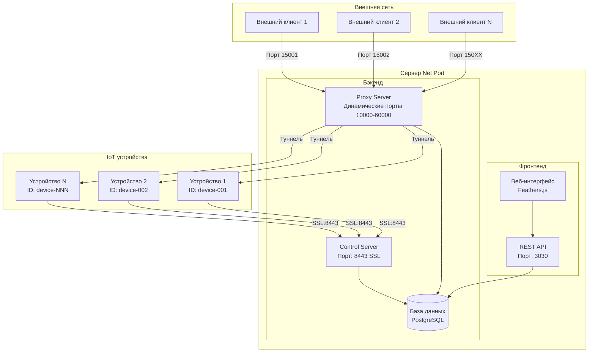
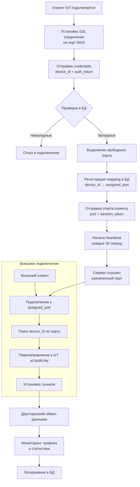
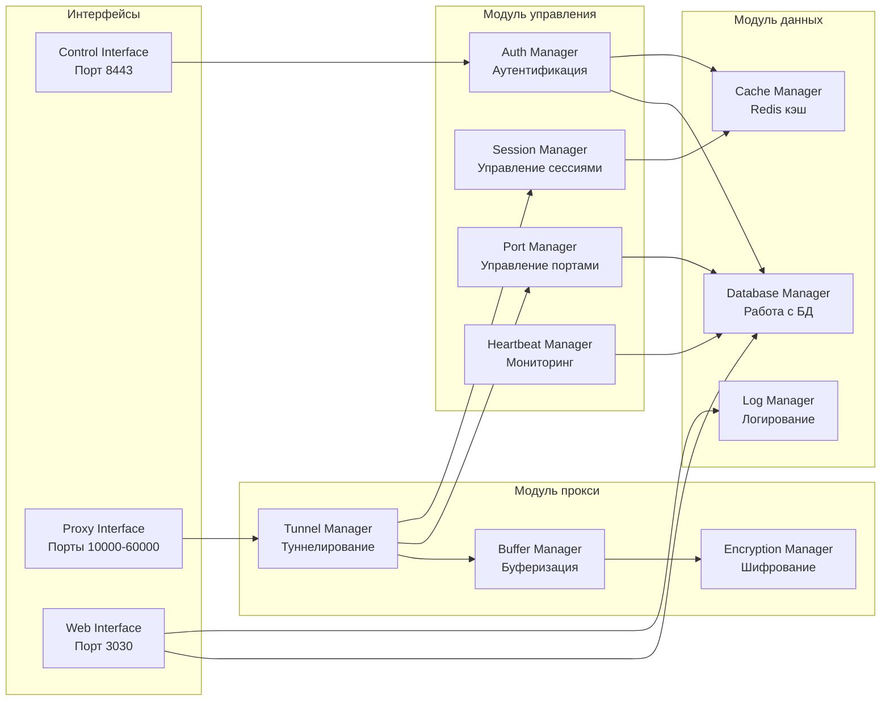
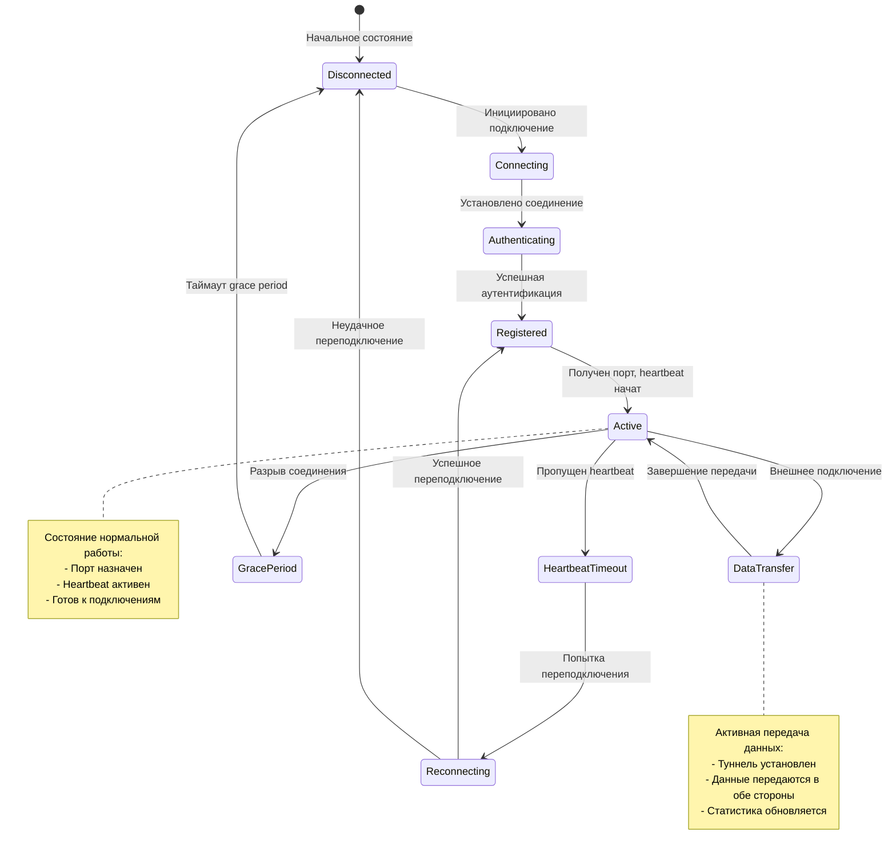
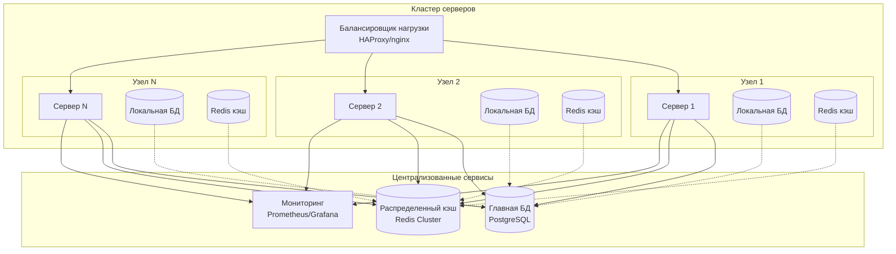

# Архитектурная диаграмма системы динамического перенаправления портов

## Общая архитектура системы

## Детальная схема потоков данных

## Компонентная архитектура сервера

## Схема состояний клиента IoT

## Схема безопасности

```mermaid
graph TD
    subgraph "Уровни безопасности"
        L1[Уровень 1: Сетевой]
        L2[Уровень 2: Транспортный]
        L3[Уровень 3: Прикладной]
        L4[Уровень 4: Данные]
    end
    
    subgraph "Механизмы L1"
        FW[Фаервол<br/>iptables/nftables]
        IPS[IPS/IDS<br/>Suricata/Snort]
        RL[Rate Limiting<br/>nginx/iptables]
    end
    
    subgraph "Механизмы L2"
        TLS[TLS 1.2+<br/>Let's Encrypt]
        PFS[Perfect Forward Secrecy]
        CIPHER[Сильные шифры]
    end
    
    subgraph "Механизмы L3"
        AUTH[Аутентификация<br/>Token-based]
        ACL[Контроль доступа<br/>RBAC]
        AUDIT[Аудит действий]
    end
    
    subgraph "Механизмы L4"
        ENC[Шифрование данных<br/>end-to-end]
        VALID[Валидация данных]
        SANIT[Санобработка входных данных]
    end
    
    L1 --> FW
    L1 --> IPS
    L1 --> RL
    
    L2 --> TLS
    L2 --> PFS
    L2 --> CIPHER
    
    L3 --> AUTH
    L3 --> ACL
    L3 --> AUDIT
    
    L4 --> ENC
    L4 --> VALID
    L4 --> SANIT
```

## Схема масштабирования

## Заключение

Предложенная архитектура обеспечивает:
1. **Масштабируемость**: Поддержка тысяч одновременных подключений
2. **Безопасность**: Многоуровневая защита на всех этапах
3. **Надёжность**: Автоматическое восстановление при сбоях
4. **Управляемость**: Централизованный контроль через веб-интерфейс
5. **Совместимость**: Интеграция с существующей инфраструктурой net_port