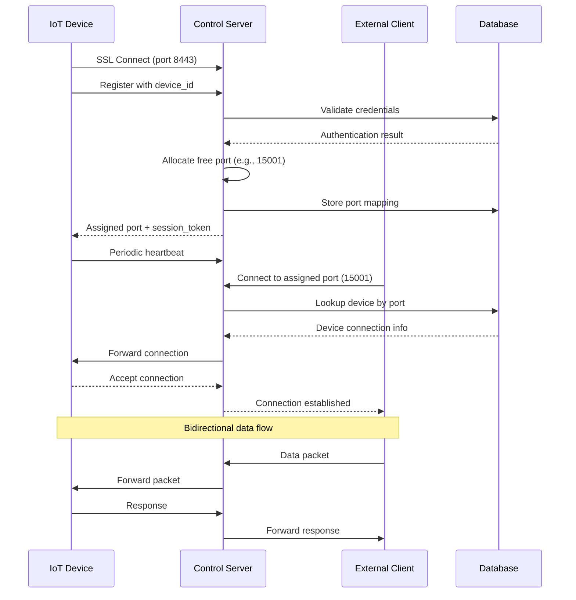

# Динамическое перенаправление портов для IoT устройств с идентификацией клиентов

## Обзор системы

Расширение существующей системы net_port для поддержки динамического назначения портов и идентификации клиентов для IoT устройств с двусторонней коммуникацией.

## Архитектурные компоненты

### 1. Сервер управления (Control Server)
- **Порт управления**: 8443 (SSL/TLS)
- **Порт данных**: динамический диапазон 10000-60000
- **База данных**: PostgreSQL (существующая)
- **Веб-интерфейс**: Feathers.js (существующий)

### 2. Клиент IoT устройства
- **Протокол подключения**: SSL/TLS с аутентификацией
- **Идентификация**: UUID + токен доступа
- **Поддержка переподключения**: автоматическое восстановление соединения

### 3. Внешние клиенты
- **Доступ к устройствам**: через назначенные динамические порты
- **Аутентификация**: через веб-интерфейс/API

## Протокол взаимодействия

### Фаза 1: Регистрация и аутентификация
```
Клиент → Сервер (порт 8443):
{
  "action": "register",
  "device_id": "uuid-v4",
  "auth_token": "pre-shared-token",
  "capabilities": ["ssh", "http", "custom"],
  "metadata": {
    "device_type": "iot_gateway",
    "version": "1.0"
  }
}

Сервер → Клиент:
{
  "status": "authenticated",
  "assigned_port": 15001,
  "session_token": "encrypted-session-token",
  "heartbeat_interval": 30
}
```

### Фаза 2: Поддержание соединения
- Heartbeat каждые 30 секунд
- Мониторинг состояния соединения
- Автоматическое переподключение при разрыве

### Фаза 3: Передача данных
- Прозрачное туннелирование TCP/UDP трафика
- SSL шифрование для всех соединений
- Статистика трафика в реальном времени

## Динамическое выделение портов

### Алгоритм выделения
1. **Диапазон портов**: 10000-60000
2. **Распределение**: round-robin с проверкой занятости
3. **Связка**: device_id → assigned_port
4. **Время жизни**: пока активно соединение + 5 минут grace period

### Таблица маппинга в БД
```sql
CREATE TABLE device_port_mappings (
    id SERIAL PRIMARY KEY,
    device_id VARCHAR(36) UNIQUE NOT NULL,
    assigned_port INTEGER NOT NULL,
    internal_address VARCHAR(45),
    internal_port INTEGER,
    protocol VARCHAR(10) DEFAULT 'tcp',
    status VARCHAR(20) DEFAULT 'active',
    created_at TIMESTAMP DEFAULT CURRENT_TIMESTAMP,
    last_heartbeat TIMESTAMP,
    expires_at TIMESTAMP,
    FOREIGN KEY (device_id) REFERENCES devices(uuid)
);
```

## Механизм идентификации клиентов

### 1. Предварительная регистрация
- Устройства регистрируются через веб-интерфейс
- Генерация UUID и токена доступа
- Настройка прав доступа и квот

### 2. Аутентификация соединения
- SSL client certificate (опционально)
- Token-based authentication
- IP whitelisting (опционально)

### 3. Сессионное управление
- Временные session tokens
- Refresh tokens для долгоживущих соединений
- Revocation capability

## Безопасность

### Шифрование
- TLS 1.2+ для всех соединений
- Perfect Forward Secrecy
- Сертификаты Let's Encrypt или самоподписанные

### Контроль доступа
- Rate limiting per device
- GeoIP filtering (опционально)
- Port scanning protection

### Мониторинг
- Логирование всех подключений
- Алёрты на подозрительную активность
- Аудит доступа

## API управления

### REST API Endpoints
```
GET    /api/devices              - список всех устройств
POST   /api/devices              - регистрация нового устройства
GET    /api/devices/:id          - информация об устройстве
PUT    /api/devices/:id          - обновление настроек
DELETE /api/devices/:id          - удаление устройства
GET    /api/devices/:id/ports    - активные порты устройства
POST   /api/devices/:id/restart  - перезапуск соединения
```

### WebSocket API для реального времени
- Статус подключения устройств
- Статистика трафика
- Уведомления о событиях

## Интеграция с существующей системой

### Модификации proxy_server.c
1. Добавить модуль управления соединениями
2. Реализовать протокол регистрации
3. Добавить динамическое создание сокетов
4. Интегрировать с БД для маппинга портов

### Модификации proxy_client.c
1. Добавить фазу аутентификации
2. Реализовать heartbeat механизм
3. Поддержка переподключения
4. Отправка метаданных устройства

### Веб-интерфейс
1. Панель управления устройствами
2. Мониторинг активных соединений
3. Назначение прав доступа
4. Просмотр статистики

## Сценарии использования

### 1. Подключение IoT шлюза
```
1. Устройство подключается к порту 8443
2. Отправляет credentials
3. Получает назначенный порт (например, 15001)
4. Начинает слушать входящие соединения
5. Внешние клиенты подключаются к server:15001
6. Трафик туннелируется к устройству
```

### 2. Множественные устройства
- Каждое устройство получает уникальный порт
- Балансировка нагрузки между портами
- Изоляция трафика между устройствами

### 3. Высокая доступность
- Поддержка кластеризации серверов
- Репликация состояния между узлами
- Миграция соединений при отказе

## Ограничения и масштабируемость

### Ограничения
- Максимум 50000 одновременных устройств (по портам)
- Пропускная способность зависит от hardware
- Задержка: добавление 1-2ms за SSL handshake

### Масштабирование
- Horizontal scaling с балансировщиком нагрузки
- Шардирование по диапазонам портов
- Кэширование маппингов в Redis

## План внедрения

### Фаза 1: Прототип
1. Модификация протокола аутентификации
2. Динамическое выделение портов
3. Базовая интеграция с веб-интерфейсом

### Фаза 2: Безопасность
1. Усиление SSL/TLS настроек
2. Реализация rate limiting
3. Система аудита и логирования

### Фаза 3: Масштабирование
1. Поддержка кластеризации
2. Оптимизация производительности
3. Мониторинг и алертинг

## Диаграмма последовательности



## Преимущества решения

1. **Безопасность**: End-to-end шифрование
2. **Масштабируемость**: Поддержка тысяч устройств
3. **Надёжность**: Автоматическое восстановление соединений
4. **Управляемость**: Централизованный веб-интерфейс
5. **Совместимость**: Интеграция с существующей инфраструктурой

## Следующие шаги

1. Детализация протокола сообщений
2. Создание тестового стенда
3. Разработка эталонной реализации
4. Тестирование безопасности и производительности
5. Документация для разработчиков устройств